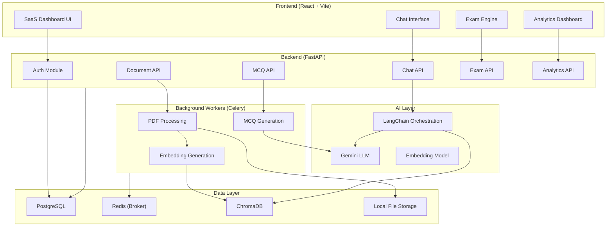
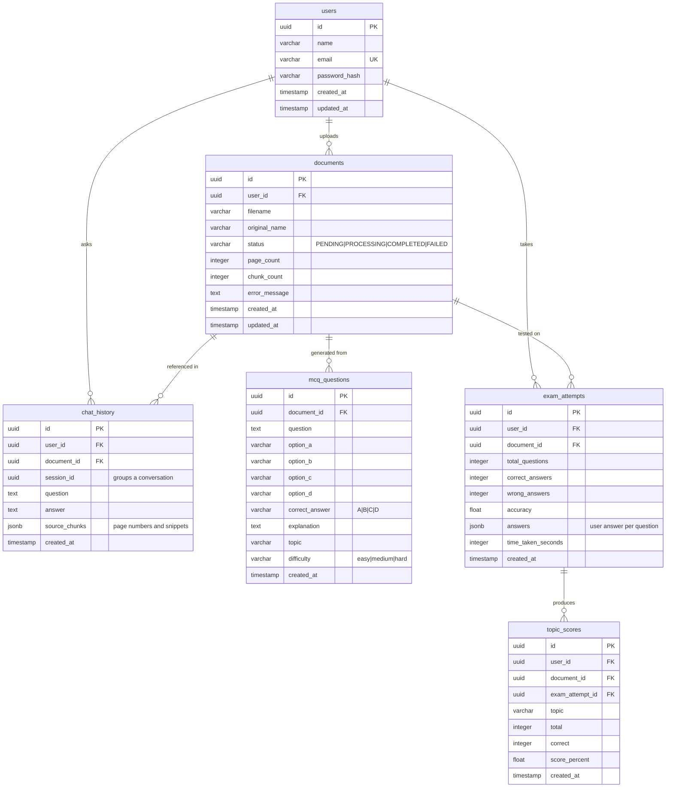

# AI Study Intelligence Platform — Implementation Plan

> **Goal**: Build a production-ready AI-powered learning platform where users upload educational PDFs, chat with documents using RAG, generate MCQ exams, track performance, and discover weak learning areas automatically.

---

## User Review Required

> [!IMPORTANT]
> **LLM Provider**: The PDF spec mentions both Gemini API and OpenAI API. This plan defaults to **Google Gemini** (via `langchain-google-genai`) for both chat completions and embeddings. If you prefer OpenAI or a different provider, let me know before I begin.

> [!IMPORTANT]
> **Vector Database**: The spec recommends ChromaDB for dev and Qdrant for production. This plan uses **ChromaDB** for initial development (simpler setup, no extra container). Qdrant can be swapped in later via a clean abstraction layer.

> [!WARNING]
> **React UI Library**: The spec says "Professional SaaS style." This plan uses **React + Vite + TypeScript** with **shadcn/ui** components and **Tailwind CSS** for a polished, modern dashboard. If you prefer plain CSS or a different component system, flag it now.

---

## Open Questions

> [!IMPORTANT]
> 1. **Gemini API Key** — Do you already have a Gemini API key, or should I set up the project to also support a local/free model (e.g., Ollama) for development without API costs?
> 2. **PostgreSQL** — Do you have PostgreSQL installed locally, or should we use a Docker-based PostgreSQL for development?
> 3. **Redis** — Same question for Redis. Docker is the easiest path on Windows.
> 4. **Scope of Phase 1 delivery** — Should I build all 10 phases end-to-end in one go, or would you prefer iterative delivery (e.g., Phases 1–4 first, then 5–10)?

---

## Architecture Overview



---

## Technology Stack

| Layer | Technology | Rationale |
|:---|:---|:---|
| **Backend Framework** | FastAPI (async) | Spec requirement; best Python async framework |
| **Database** | PostgreSQL + SQLAlchemy 2.0 + Alembic | Spec requirement; industry standard ORM + migrations |
| **Background Tasks** | Celery + Redis | Spec requirement; decouples heavy processing |
| **AI Orchestration** | LangChain | Spec requirement; RAG pipeline, chains, memory |
| **LLM** | Google Gemini (`gemini-2.0-flash`) | Cost-effective, fast, good for Q&A and MCQ generation |
| **Embeddings** | `models/text-embedding-004` (Google) | High quality, 768-dim, good for semantic search |
| **Vector Database** | ChromaDB (dev) → Qdrant (prod) | Spec requirement; simple local dev, scalable prod |
| **PDF Extraction** | PyMuPDF (`fitz`) + pdfplumber fallback | Spec requirement; PyMuPDF is fastest |
| **Frontend** | React 19 + Vite + TypeScript | Spec says React; Vite is modern standard |
| **UI Components** | shadcn/ui + Tailwind CSS + Recharts | Professional SaaS quality with charts |
| **Auth** | JWT (access + refresh tokens) + bcrypt | Spec requirement |
| **Containerization** | Docker + Docker Compose | Spec requirement for deployment |

---

## Project Folder Structure

```
d:\Project\PdfAnalyzer\
├── backend/
│   ├── alembic/                    # Database migrations
│   │   ├── versions/
│   │   └── env.py
│   ├── alembic.ini
│   ├── app/
│   │   ├── __init__.py
│   │   ├── main.py                 # FastAPI app entry point
│   │   ├── core/                   # Global config, security, DB
│   │   │   ├── __init__.py
│   │   │   ├── config.py           # Pydantic BaseSettings
│   │   │   ├── database.py         # SQLAlchemy engine/session
│   │   │   └── security.py         # JWT + bcrypt helpers
│   │   ├── models/                 # SQLAlchemy ORM models
│   │   │   ├── __init__.py
│   │   │   ├── user.py
│   │   │   ├── document.py
│   │   │   ├── chat.py
│   │   │   ├── mcq.py
│   │   │   └── exam.py
│   │   ├── schemas/                # Pydantic request/response schemas
│   │   │   ├── __init__.py
│   │   │   ├── auth.py
│   │   │   ├── document.py
│   │   │   ├── chat.py
│   │   │   ├── mcq.py
│   │   │   └── exam.py
│   │   ├── api/                    # Route handlers (thin routers)
│   │   │   ├── __init__.py
│   │   │   ├── auth.py
│   │   │   ├── documents.py
│   │   │   ├── chat.py
│   │   │   ├── mcq.py
│   │   │   ├── exam.py
│   │   │   └── analytics.py
│   │   ├── services/               # Business logic layer
│   │   │   ├── __init__.py
│   │   │   ├── auth_service.py
│   │   │   ├── document_service.py
│   │   │   ├── chat_service.py
│   │   │   ├── mcq_service.py
│   │   │   ├── exam_service.py
│   │   │   └── analytics_service.py
│   │   ├── rag/                    # RAG pipeline components
│   │   │   ├── __init__.py
│   │   │   ├── pdf_processor.py    # PDF extraction + cleaning
│   │   │   ├── chunker.py          # Text chunking strategies
│   │   │   ├── embedder.py         # Embedding generation
│   │   │   ├── vector_store.py     # ChromaDB interface
│   │   │   └── qa_chain.py         # RAG Q&A chain
│   │   ├── mcq/                    # MCQ generation engine
│   │   │   ├── __init__.py
│   │   │   ├── generator.py        # LLM-based MCQ generation
│   │   │   └── validator.py        # JSON schema validation
│   │   ├── workers/                # Celery tasks
│   │   │   ├── __init__.py
│   │   │   ├── celery_app.py       # Celery configuration
│   │   │   └── tasks.py            # Task definitions
│   │   └── utils/                  # Shared utilities
│   │       ├── __init__.py
│   │       └── exceptions.py       # Custom exception classes
│   ├── uploads/                    # Uploaded PDF storage
│   ├── requirements.txt
│   ├── Dockerfile
│   └── .env.example
├── frontend/
│   ├── public/
│   ├── src/
│   │   ├── components/
│   │   │   ├── ui/                 # shadcn/ui base components
│   │   │   ├── layout/            # Shell, Sidebar, Header
│   │   │   ├── auth/              # LoginForm, RegisterForm
│   │   │   ├── documents/         # UploadCard, DocumentList
│   │   │   ├── chat/              # ChatWindow, MessageBubble
│   │   │   ├── exam/              # QuestionCard, Timer, Results
│   │   │   └── analytics/         # WeakTopicChart, ScoreCard
│   │   ├── pages/
│   │   │   ├── LoginPage.tsx
│   │   │   ├── RegisterPage.tsx
│   │   │   ├── DashboardPage.tsx
│   │   │   ├── UploadPage.tsx
│   │   │   ├── ChatPage.tsx
│   │   │   ├── ExamPage.tsx
│   │   │   ├── ResultsPage.tsx
│   │   │   └── WeakTopicsPage.tsx
│   │   ├── hooks/                  # Custom React hooks
│   │   ├── lib/                    # API client, utilities
│   │   ├── store/                  # Zustand state stores
│   │   ├── App.tsx
│   │   ├── main.tsx
│   │   └── index.css               # Global styles + Tailwind
│   ├── tailwind.config.ts
│   ├── tsconfig.json
│   ├── vite.config.ts
│   ├── package.json
│   └── Dockerfile
├── docker-compose.yml
├── .gitignore
└── README.md
```

---

## Database Schema



---

## Proposed Changes — By Phase

### Phase 1: FastAPI Setup + Database + Authentication

#### [NEW] backend/app/main.py
- FastAPI app factory with CORS middleware, lifespan events, router registration
- Health check endpoint

#### [NEW] backend/app/core/config.py
- Pydantic `BaseSettings` loading from `.env`: DB URL, Redis URL, JWT secret, Gemini API key, upload path

#### [NEW] backend/app/core/database.py
- SQLAlchemy 2.0 async engine + `AsyncSession` factory using `asyncpg`
- `get_db` dependency yielding sessions

#### [NEW] backend/app/core/security.py
- `hash_password()`/`verify_password()` using `passlib[bcrypt]`
- `create_access_token()`/`create_refresh_token()` using `python-jose`
- `get_current_user` dependency extracting user from JWT

#### [NEW] backend/app/models/user.py
- `User` SQLAlchemy model: id (UUID), name, email (unique), password_hash, created_at, updated_at

#### [NEW] backend/app/schemas/auth.py
- `UserRegister`, `UserLogin`, `UserResponse`, `TokenResponse` Pydantic schemas

#### [NEW] backend/app/api/auth.py
- `POST /api/auth/register` — create user with hashed password
- `POST /api/auth/login` — verify credentials, return JWT pair
- `POST /api/auth/refresh` — refresh access token
- `GET /api/auth/me` — get current user profile

#### [NEW] backend/app/services/auth_service.py
- `register_user()`, `authenticate_user()`, `refresh_token()` business logic

#### [NEW] backend/alembic/ + alembic.ini
- Alembic init with async driver, initial migration creating `users` table

#### [NEW] backend/requirements.txt
```
fastapi[standard]>=0.115
uvicorn[standard]
sqlalchemy[asyncio]>=2.0
asyncpg
alembic
passlib[bcrypt]
python-jose[cryptography]
pydantic-settings
python-multipart
```

#### [NEW] backend/.env.example
- Template for all required environment variables

---

### Phase 2: PDF Upload + Text Extraction

#### [NEW] backend/app/models/document.py
- `Document` model with status enum (PENDING → PROCESSING → COMPLETED → FAILED)

#### [NEW] backend/app/schemas/document.py
- `DocumentUpload`, `DocumentResponse`, `DocumentListResponse`

#### [NEW] backend/app/api/documents.py
- `POST /api/documents/upload` — accept PDF, save to disk, create DB record, return immediately
- `GET /api/documents` — list user's documents with status
- `GET /api/documents/{id}` — single document detail
- `DELETE /api/documents/{id}` — delete document + vectors + file

#### [NEW] backend/app/services/document_service.py
- File validation (type, size), save to `uploads/`, create DB record, dispatch Celery task

#### [NEW] backend/app/rag/pdf_processor.py
- `extract_text(file_path)` — PyMuPDF primary, pdfplumber fallback
- Text cleaning: normalize whitespace, fix encoding, remove headers/footers

---

### Phase 3: Chunking + Embeddings + Vector Storage

#### [NEW] backend/app/rag/chunker.py
- `RecursiveCharacterTextSplitter` with chunk_size=1000, overlap=200
- Metadata enrichment: `document_id`, `user_id`, `page_number`, `chunk_index`

#### [NEW] backend/app/rag/embedder.py
- Google Generative AI embeddings (`text-embedding-004`)
- Batch embedding with rate limiting
- Abstraction interface for swapping to OpenAI/sentence-transformers

#### [NEW] backend/app/rag/vector_store.py
- ChromaDB persistent client
- `add_document_chunks(doc_id, chunks, embeddings)` 
- `search_similar(query_embedding, doc_id, top_k=5)`
- `delete_document(doc_id)` — cleanup on document deletion
- Collection-per-user or filtered-by-metadata strategy

#### [NEW] backend/app/workers/celery_app.py
- Celery app with Redis broker/backend config
- `task_acks_late=True`, `worker_prefetch_multiplier=1`

#### [NEW] backend/app/workers/tasks.py
- `process_document(document_id)` task: extract → clean → chunk → embed → store vectors → update DB status

---

### Phase 4: RAG Chat System

#### [NEW] backend/app/rag/qa_chain.py
- LangChain RAG chain:
  1. Convert user question → embedding
  2. Vector similarity search (top 5 chunks, filtered by document_id)
  3. Assemble context prompt with source attribution
  4. Call Gemini LLM with system prompt enforcing "answer from document only"
  5. Return answer + source page numbers
- Hallucination guardrail: system prompt instructs model to say "The document does not contain enough information"

#### [NEW] backend/app/models/chat.py
- `ChatHistory` model: session_id groups conversations, stores Q&A pairs with source_chunks JSON

#### [NEW] backend/app/schemas/chat.py
- `ChatQuestion`, `ChatResponse` (answer + sources), `ChatSessionList`, `ChatHistoryResponse`

#### [NEW] backend/app/api/chat.py
- `POST /api/chat/question` — send question for a document, get AI answer
- `GET /api/chat/sessions/{document_id}` — list chat sessions for a document
- `GET /api/chat/history/{session_id}` — get full conversation history

#### [NEW] backend/app/services/chat_service.py
- Manages session creation, conversation retrieval, calls RAG chain

---

### Phase 5: Conversation Memory

#### [MODIFY] backend/app/rag/qa_chain.py
- Add **short-term memory**: include last N messages from current session in the LLM prompt as conversation context
- Add **long-term memory**: store all Q&A pairs in `chat_history` table, retrievable by session_id
- LangChain `ConversationBufferWindowMemory` (window=5) for context continuity

#### [MODIFY] backend/app/api/chat.py
- Chat endpoint now accepts optional `session_id` to continue an existing conversation
- New session auto-created if none provided

---

### Phase 6: Answer Summary Generation

#### [NEW] backend/app/api/summary.py (new router — not in original structure but logically separate)
- Note: This will be added to `backend/app/api/` and registered in `main.py`

Routes:
- `POST /api/summary/summarize` — takes an existing AI answer, returns key points (no re-retrieval)
- `POST /api/summary/simplify` — rewrites answer in simpler language
- `POST /api/summary/generate-mcq` — generates MCQ from a single answer

#### [NEW] backend/app/services/summary_service.py
- Direct LLM calls (no RAG) on existing answer text
- Prompt templates for summarize, simplify, and single-answer MCQ

---

### Phase 7: MCQ Generation Engine

#### [NEW] backend/app/mcq/generator.py
- Extract important concepts from document chunks via LLM
- Generate MCQs with structured JSON output schema
- Support configurable count (20/40/60) and difficulty (easy/medium/hard)
- Prompt engineering: role as educator, Bloom's Taxonomy levels, plausible distractors
- Batch generation with retry logic

#### [NEW] backend/app/mcq/validator.py
- JSON schema validation for MCQ output
- Deduplication check
- Minimum quality gates (non-empty fields, distinct options)

#### [NEW] backend/app/models/mcq.py
- `MCQQuestion` model with topic and difficulty fields

#### [NEW] backend/app/schemas/mcq.py
- `MCQGenerateRequest` (document_id, count, difficulty)
- `MCQResponse`, `MCQListResponse`

#### [NEW] backend/app/api/mcq.py
- `POST /api/mcq/create` — trigger async MCQ generation for a document
- `GET /api/mcq/{document_id}` — get generated MCQs
- `GET /api/mcq/status/{task_id}` — check generation progress

#### [NEW] backend/app/services/mcq_service.py
- Orchestrate MCQ generation: select chunks → extract concepts → generate → validate → save

#### [MODIFY] backend/app/workers/tasks.py
- Add `generate_mcqs(document_id, count, difficulty)` Celery task

---

### Phase 8: Exam Engine

#### [NEW] backend/app/models/exam.py
- `ExamAttempt` model: tracks user's test session with answers JSON, score, timing

#### [NEW] backend/app/schemas/exam.py
- `ExamStartRequest`, `ExamSubmitRequest` (answers array), `ExamResultResponse`

#### [NEW] backend/app/api/exam.py
- `POST /api/exam/start` — create exam attempt, return randomized questions
- `POST /api/exam/submit` — submit answers, auto-grade, calculate scores
- `GET /api/exam/results/{attempt_id}` — detailed results with explanations
- `GET /api/exam/history` — user's past exam attempts

#### [NEW] backend/app/services/exam_service.py
- Score calculation, per-topic breakdown, answer comparison logic

---

### Phase 9: Weak Topic Analytics

#### [NEW] backend/app/models/exam.py (extended)
- `TopicScore` model alongside `ExamAttempt`

#### [NEW] backend/app/schemas/exam.py (extended)
- `WeakTopicResponse`, `TopicPerformance`

#### [NEW] backend/app/api/analytics.py
- `GET /api/analytics/weak-topics` — aggregated weak topics across all attempts
- `GET /api/analytics/performance/{document_id}` — per-document performance breakdown
- `GET /api/analytics/dashboard` — overall learning stats

#### [NEW] backend/app/services/analytics_service.py
- Aggregate topic_scores across exam attempts
- Identify topics below threshold (e.g., <60%)
- Generate study recommendations
- Return sorted weak-to-strong topic list

---

### Phase 10: Frontend (React + Vite)

#### [NEW] frontend/ (entire directory)

**Pages to build:**

| Page | Key Components | Features |
|:---|:---|:---|
| **Login** | Auth form, social links | JWT token storage, redirect |
| **Register** | Registration form | Validation, error display |
| **Dashboard** | Document cards, stats | Upload CTA, recent activity |
| **Upload** | Drag-drop zone, progress bar | File validation, processing status |
| **Chat** | Message list, input, sidebar | Streaming feel, source citations, summary/simplify/MCQ buttons |
| **Exam Setup** | Config panel (count, difficulty) | MCQ generation trigger |
| **Exam** | Question card, option buttons, timer, navigation | Auto-submit on timeout |
| **Results** | Score summary, per-topic breakdown | Correct/wrong indicators, explanations |
| **Weak Topics** | Radar/bar charts, recommendations | Recharts visualizations |

**Design System:**
- Dark mode default with light mode toggle
- Glassmorphism cards with subtle backdrop blur
- Animated transitions between pages (Framer Motion)
- Inter font family
- Color palette: Deep indigo primary (#4F46E5), emerald accents (#10B981), warm backgrounds

---

### Phase 10b: Docker Deployment

#### [NEW] docker-compose.yml
```yaml
services:
  backend:
    build: ./backend
    ports: ["8000:8000"]
    depends_on: [postgres, redis, chromadb]
    env_file: ./backend/.env
  
  celery-worker:
    build: ./backend
    command: celery -A app.workers.celery_app worker -l info
    depends_on: [redis, postgres]
    env_file: ./backend/.env
  
  frontend:
    build: ./frontend
    ports: ["3000:3000"]
    depends_on: [backend]
  
  postgres:
    image: postgres:16-alpine
    volumes: [pgdata:/var/lib/postgresql/data]
    environment:
      POSTGRES_DB: studyai
      POSTGRES_USER: studyai
      POSTGRES_PASSWORD: ${DB_PASSWORD}
  
  redis:
    image: redis:7-alpine
    ports: ["6379:6379"]
  
  chromadb:
    image: chromadb/chroma:latest
    ports: ["8001:8000"]
    volumes: [chromadata:/chroma/chroma]

volumes:
  pgdata:
  chromadata:
```

#### [NEW] backend/Dockerfile
- Multi-stage build: Python 3.12-slim, install deps, copy app

#### [NEW] frontend/Dockerfile
- Multi-stage: Node 20-alpine, build Vite app, serve with nginx

---

## API Route Summary

| Method | Endpoint | Auth | Description |
|:---|:---|:---|:---|
| `POST` | `/api/auth/register` | ✗ | Register new user |
| `POST` | `/api/auth/login` | ✗ | Login, get JWT tokens |
| `POST` | `/api/auth/refresh` | ✗ | Refresh access token |
| `GET` | `/api/auth/me` | ✓ | Get current user |
| `POST` | `/api/documents/upload` | ✓ | Upload PDF |
| `GET` | `/api/documents` | ✓ | List user documents |
| `GET` | `/api/documents/{id}` | ✓ | Document details + status |
| `DELETE` | `/api/documents/{id}` | ✓ | Delete document |
| `POST` | `/api/chat/question` | ✓ | Ask question about document |
| `GET` | `/api/chat/sessions/{doc_id}` | ✓ | List chat sessions |
| `GET` | `/api/chat/history/{session_id}` | ✓ | Get conversation history |
| `POST` | `/api/summary/summarize` | ✓ | Summarize an answer |
| `POST` | `/api/summary/simplify` | ✓ | Simplify an answer |
| `POST` | `/api/summary/generate-mcq` | ✓ | MCQ from single answer |
| `POST` | `/api/mcq/create` | ✓ | Generate MCQs for document |
| `GET` | `/api/mcq/{doc_id}` | ✓ | Get MCQs |
| `GET` | `/api/mcq/status/{task_id}` | ✓ | Check MCQ generation status |
| `POST` | `/api/exam/start` | ✓ | Start exam attempt |
| `POST` | `/api/exam/submit` | ✓ | Submit exam answers |
| `GET` | `/api/exam/results/{id}` | ✓ | Get exam results |
| `GET` | `/api/exam/history` | ✓ | Past exam attempts |
| `GET` | `/api/analytics/weak-topics` | ✓ | Weak topic analysis |
| `GET` | `/api/analytics/performance/{doc_id}` | ✓ | Per-document performance |
| `GET` | `/api/analytics/dashboard` | ✓ | Overall learning stats |

---

## Key Design Decisions

### 1. Thin Routers + Service Layer
All business logic lives in `services/`. API routes only parse input, call services, and return responses. This keeps the codebase testable and maintainable.

### 2. Async Everything
- SQLAlchemy 2.0 `AsyncSession` with `asyncpg`
- FastAPI async route handlers
- Celery for truly heavy work (PDF processing, embedding, MCQ generation)

### 3. RAG Pipeline Quality
- **Chunking**: RecursiveCharacterTextSplitter (1000 tokens, 200 overlap) preserving paragraph boundaries
- **Retrieval**: Top-5 similarity search filtered by document_id
- **Guardrails**: System prompt enforces "answer from document only" with explicit fallback message
- **Source Attribution**: Every answer includes page numbers and chunk snippets

### 4. MCQ Quality
- Structured JSON output schema enforced via LLM
- Prompt includes educator role, Bloom's Taxonomy, distractor plausibility rules
- Validation layer catches malformed output and retries

### 5. Security
- bcrypt password hashing (never plain text)
- JWT with short-lived access tokens (30min) + longer refresh tokens (7 days)
- All API keys in `.env`, never committed
- CORS restricted to frontend origin
- User can only access their own documents/exams/chats

---

## Verification Plan

### Automated Tests
```bash
# Backend unit + integration tests
cd backend && pytest tests/ -v --cov=app

# Test specific modules
pytest tests/test_auth.py -v
pytest tests/test_documents.py -v
pytest tests/test_rag.py -v
pytest tests/test_mcq.py -v
```

### Manual Verification
For each phase, I will:
1. **Run the backend** (`uvicorn app.main:app --reload`) and test API endpoints via the FastAPI Swagger UI at `/docs`
2. **Run the frontend** (`npm run dev`) and verify all UI pages render correctly
3. **End-to-end flow**: Register → Login → Upload PDF → Wait for processing → Chat with document → Generate MCQs → Take exam → View weak topics
4. **Edge cases**: Large PDF upload, invalid file type, expired JWT, empty document, AI API failure

### Build Verification
```bash
# Backend
cd backend && pip install -r requirements.txt
alembic upgrade head

# Frontend
cd frontend && npm install && npm run build

# Docker
docker-compose up --build
```

---

## Estimated File Count
- **Backend**: ~35 Python files
- **Frontend**: ~30 TypeScript/TSX files + config
- **Infrastructure**: 3 Dockerfiles + docker-compose + configs
- **Total**: ~70 files

This is a substantial project. I recommend building it in phases with verification checkpoints after each phase.
